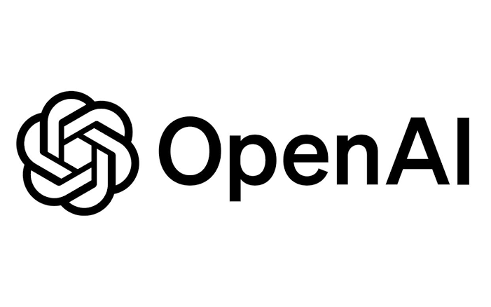

<div align="center">
  

  # Cross-platform App Builder для Codex

  Практический Codex Skill для разработки одного Flutter-приложения под web и mobile.

  [English](README.md) · **Русский**
</div>

## Что умеет skill

- проектировать адаптивные Flutter-интерфейсы вместо масштабирования desktop-версии;
- находить lifecycle-ошибки, нестабильные streams и гонки при быстрой навигации;
- связывать Firebase Auth, Firestore-схему, realtime-слушатели, роли и Security Rules;
- реализовывать общие чаты, контакты, группы и task boards с корректными правами;
- поддерживать светлую и тёмную темы, пользовательские фоны и доступный контраст;
- добавлять i18n через ARB и Flutter localization delegates;
- проверять, собирать и выпускать web/mobile-версии без утечки приватных ключей.

Workflow основан на evidence-led подходе из `mega-orchestrator`: сначала воспроизводится реальное состояние и прослеживается источник данных, затем вносится минимальное связное изменение и проверяется итоговая сборка.

## Структура

```text
Codex/
└── crossplatform-app-builder/
    ├── SKILL.md
    ├── agents/openai.yaml
    └── references/
        ├── adaptive-ui.md
        ├── firebase-realtime.md
        └── release-checklist.md
```

## Установка в Codex

```powershell
git clone https://github.com/ReunionRS/crossplatform-skill-for-agent.git
Copy-Item -Recurse .\crossplatform-skill-for-agent\Codex\crossplatform-app-builder "$env:CODEX_HOME\skills\crossplatform-app-builder"
```

Если `CODEX_HOME` не задан, используйте `%USERPROFILE%\.codex\skills\crossplatform-app-builder`. После установки перезапустите Codex.

```text
$crossplatform-app-builder Исправь адаптивную раскладку чатов на web и mobile и проверь Firestore-права.
```

Skill также поддерживает автоматический выбор для подходящих задач.

## Технологии

<p>
  
  
  
  
  
  
</p>

## Использование

Skill является инструкцией для Codex и не включает исходный код конкретного приложения, Firebase-проект или учётные данные. Проверяйте сгенерированные изменения, правила доступа и целевое окружение перед production-деплоем.

OpenAI и Codex являются товарными знаками соответствующих правообладателей. Этот репозиторий — независимый community-проект и не является официальным продуктом OpenAI.
